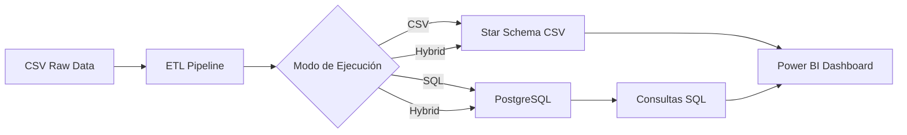
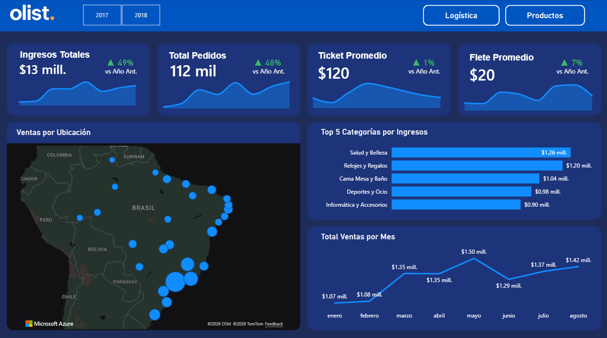
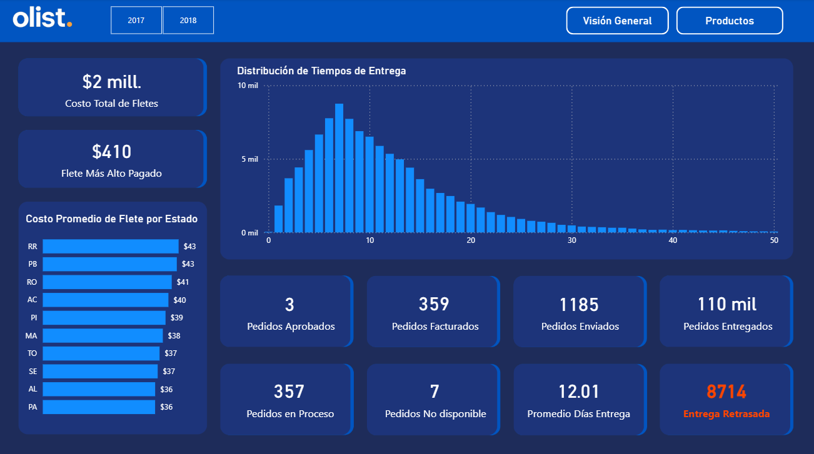
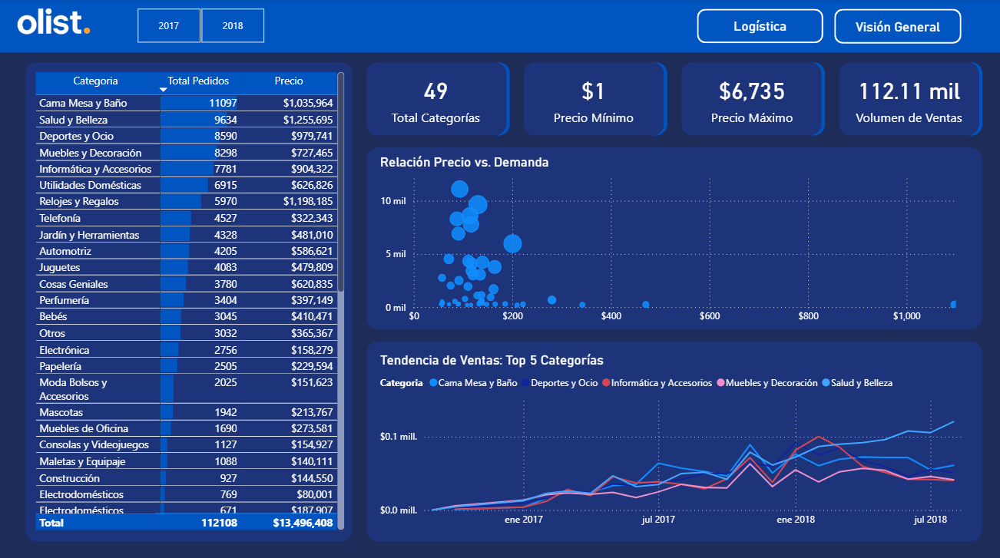

# 🛒 Brazilian E-Commerce Data Analysis

<div align="center">


*Análisis integral de comercio electrónico utilizando datos reales de Olist Store (Brasil)*

[🎯 Características](#-características-principales) • [📊 Dataset](#-dataset) • [🚀 Inicio Rápido](#-inicio-rápido) • [📈 Dashboard](#-dashboard-power-bi)

</div>

---

## 📋 Tabla de Contenidos

- [Descripción del Proyecto](#-descripción-del-proyecto)
- [Características Principales](#-características-principales)
- [Dataset](#-dataset)
- [Arquitectura del Proyecto](#-arquitectura-del-proyecto)
- [Inicio Rápido](#-inicio-rápido)
- [Pipeline ETL](#-pipeline-etl)
- [Star Schema](#-star-schema)
- [Dashboard Power BI](#-dashboard-power-bi)
- [Requisitos Técnicos](#-requisitos-técnicos)
- [Estructura del Proyecto](#-estructura-del-proyecto)
- [Roadmap](#-roadmap)

---

## 🎯 Descripción del Proyecto

Este proyecto implementa un **pipeline ETL completo** y un **dashboard analítico** para analizar datos de comercio electrónico del marketplace brasileño Olist. El sistema procesa más de **100,000 órdenes** realizadas entre 2016-2018, proporcionando insights sobre comportamiento de clientes, rendimiento de vendedores, y eficiencia logística.

### 🎨 ¿Por qué este proyecto?

- **Datos Reales**: Dataset público de Olist con información comercial verificada
- **Escalabilidad**: Arquitectura modular preparada para millones de registros
- **Flexibilidad**: Funciona con o sin base de datos (PostgreSQL opcional)
- **Producción Ready**: Código profesional con logging, validaciones y manejo de errores
- **Business Intelligence**: Star schema optimizado para análisis OLAP

---

## ✨ Características Principales

### 🔄 Pipeline ETL Híbrido
- **3 Modos de Ejecución**:
  - 🗄️ `--mode sql`: Carga datos a PostgreSQL
  - 📁 `--mode csv`: Genera CSV procesados (sin PostgreSQL)
  - 🔀 `--mode hybrid`: Ambos simultáneamente
- **Validación de Datos**: Detección de duplicados, nulos, y tipos incorrectos
- **Logging Estructurado**: Trazabilidad completa del proceso ETL
- **Métricas de Calidad**: Reportes automáticos de calidad de datos

### 📊 Modelado Dimensional
- **Star Schema** optimizado para análisis
- **5 Dimensiones**: Clientes, Vendedores, Productos, Fecha, Reviews
- **1 Tabla de Hechos**: Ventas con métricas calculadas
- **Traducciones**: Categorías de productos en inglés

### 📈 Métricas de Negocio
- Análisis de ventas por región, categoría y tiempo
- KPIs de entrega (on-time delivery rate)
- Análisis de satisfacción del cliente (review scores)
- Segmentación RFM (Recency, Frequency, Monetary)
- Análisis de métodos de pago e installments

---

## 📊 Dataset

**Fuente**: [Brazilian E-Commerce Public Dataset by Olist](https://www.kaggle.com/datasets/olistbr/brazilian-ecommerce)

### Información del Dataset

- **Período**: Septiembre 2016 - Agosto 2018
- **Órdenes**: ~100,000 transacciones
- **Clientes**: ~99,000 únicos
- **Vendedores**: ~3,000 activos
- **Productos**: ~32,000 SKUs
- **Geografía**: +4,000 ciudades brasileñas

### Archivos Raw Incluidos

```
data/raw/
├── olist_customers_dataset.csv           (99,441 registros)
├── olist_sellers_dataset.csv             (3,095 registros)
├── olist_products_dataset.csv            (32,951 registros)
├── olist_orders_dataset.csv              (99,441 registros)
├── olist_order_items_dataset.csv         (112,650 registros)
├── olist_order_payments_dataset.csv      (103,886 registros)
├── olist_order_reviews_dataset.csv       (99,224 registros)
├── olist_geolocation_dataset.csv         (1,000,163 registros)
└── product_category_name_translation.csv (71 categorías)
```

---

## 🏗️ Arquitectura del Proyecto



### Flujo de Datos

1. **Extracción**: Lectura de 9 archivos CSV raw (~1.4M registros totales)
2. **Transformación**: 
   - Normalización de columnas
   - Validación de tipos de datos
   - Conversión de fechas
   - Joins entre tablas
   - Cálculo de métricas
3. **Carga**:
   - PostgreSQL: Carga incremental con chunks
   - CSV: Exportación de star schema procesado
4. **Análisis**: Conexión directa con Power BI

---

## 🚀 Inicio Rápido

### 1️⃣ Clonar el Repositorio

```bash
git clone https://github.com/Ebexe/Brazilian-E-Commerce.git
cd brazilian-ecommerce-analysis
```

### 2️⃣ Instalar Dependencias

```bash
pip install -r requirements.txt
```

**Dependencias principales:**
- `pandas`: Procesamiento de datos
- `sqlalchemy`: Conexión a PostgreSQL
- `psycopg2`: Driver PostgreSQL
- `python-dotenv`: Gestión de variables de entorno

### 3️⃣ Ejecutar el Pipeline ETL

#### 🎯 Opción A: Solo CSV (Recomendado para Reclutadores)

**No requiere PostgreSQL**. Genera archivos procesados listos para Power BI.

```bash
python scripts/01_etl_loader.py --mode csv
```

**Salida**:
```
✓ CSV procesados: 6 exitosos, 0 fallidos
⏱ Tiempo total: 0:00:08
```

Archivos generados en `data/processed/`:
- `dim_customers.csv` (8.3 MB)
- `dim_sellers.csv` (0.2 MB)
- `dim_products.csv` (3.1 MB)
- `dim_date.csv` (0.02 MB)
- `dim_reviews.csv` (13.4 MB)
- `fact_sales.csv` (34.9 MB)

#### 🗄️ Opción B: Con PostgreSQL

1. **Crear Base de Datos**:
```sql
CREATE DATABASE ecommerce_olist;
```

2. **Configurar Variables de Entorno**:
```bash
# Crear archivo .env
DB_USER=postgres
DB_PASSWORD=tu_password
DB_HOST=localhost
DB_PORT=5432
DB_NAME=ecommerce_olist
```

3. **Ejecutar Pipeline**:
```bash
# Solo PostgreSQL
python scripts/01_etl_loader.py --mode sql

# PostgreSQL + CSV (Híbrido)
python scripts/01_etl_loader.py --mode hybrid
```

---

## 🔄 Pipeline ETL

### Características Técnicas

#### ✅ Validación de Datos
```python
✓ Detección de duplicados
✓ Análisis de valores nulos
✓ Conversión automática de tipos
✓ Normalización de nombres de columnas
✓ Validación de integridad referencial
```

#### 📊 Métricas de Calidad
El pipeline reporta automáticamente:
- Filas procesadas vs. rechazadas
- Porcentaje de valores nulos
- Uso de memoria
- Tiempo de procesamiento
- Registros duplicados

#### 🪵 Logging Estructurado
Todos los logs se guardan en `logs/` con:
- Timestamp preciso
- Nivel de severidad (DEBUG, INFO, WARNING, ERROR)
- Función origen
- Métricas de ejecución

**Ejemplo de log**:
```
2026-01-05 12:27:49 | INFO  | load_table_to_database | ✓ Carga exitosa
  Filas: 99,441 | Columnas: 5 | Nulos: 0.0% | Memoria: 8.26 MB
```

### Comandos Disponibles

```bash
# Ver ayuda
python scripts/01_etl_loader.py --help

# Solo CSV (sin PostgreSQL)
python scripts/01_etl_loader.py --mode csv

# Solo PostgreSQL
python scripts/01_etl_loader.py --mode sql

# Híbrido (por defecto)
python scripts/01_etl_loader.py --mode hybrid
```

---

## ⭐ Star Schema

### Modelo Dimensional

```
                    ┌─────────────────┐
                    │   dim_date      │
                    ├─────────────────┤
                    │ date (PK)       │
                    │ year            │
                    │ quarter         │
                    │ month           │
                    │ day             │
                    │ day_of_week     │
                    └────────┬────────┘
                             │
        ┌────────────────────┼────────────────────┐
        │                    │                    │
┌───────┴────────┐  ┌────────┴────────┐  ┌───────┴─────────┐
│ dim_customers  │  │   fact_sales    │  │  dim_sellers    │
├────────────────┤  ├─────────────────┤  ├─────────────────┤
│ customer_id(PK)│◄─┤ order_id (PK)   │─►│ seller_id (PK)  │
│ unique_id      │  │ customer_id(FK) │  │ zip_code        │
│ city           │  │ seller_id (FK)  │  │ city            │
│ state          │  │ product_id (FK) │  │ state           │
│ zip_code       │  │ order_date (FK) │  └─────────────────┘
└────────────────┘  │ item_price      │
                    │ freight_value   │  ┌─────────────────┐
                    │ payment_value   │  │  dim_products   │
                    │ delivery_days   │  ├─────────────────┤
                    │ on_time_delivery│◄─┤ product_id (PK) │
                    │ review_score    │  │ category        │
                    └─────────────────┘  │ category_en     │
                             │            │ weight_g        │
                             │            │ dimensions      │
                    ┌────────┴────────┐   └─────────────────┘
                    │  dim_reviews    │
                    ├─────────────────┤
                    │ review_id (PK)  │
                    │ order_id (FK)   │
                    │ score           │
                    │ comment         │
                    └─────────────────┘
```

### Descripción de Tablas

#### 📊 Fact Table: `fact_sales`

**117,604 registros** | **21 columnas** | **34.9 MB**

Tabla de hechos con transacciones granulares (nivel order_item).

**Claves foráneas**:
- `customer_id` → dim_customers
- `seller_id` → dim_sellers
- `product_id` → dim_products
- `order_date` → dim_date
- `order_id` → dim_reviews

**Métricas calculadas**:
- `total_item_value`: precio + flete
- `delivery_days`: días desde compra hasta entrega
- `on_time_delivery`: flag binario (1 = a tiempo, 0 = tarde)

**Dimensiones temporales**:
- `order_purchase_timestamp`
- `order_approved_at`
- `order_delivered_customer_date`
- `order_estimated_delivery_date`

#### 👥 Dimension: `dim_customers`

**99,441 registros** | **5 columnas** | **8.3 MB**

Información demográfica de clientes.

```
customer_id (PK)
customer_unique_id
customer_zip_code_prefix
customer_city
customer_state
```

#### 🏪 Dimension: `dim_sellers`

**3,095 registros** | **4 columnas** | **0.2 MB**

Vendedores registrados en la plataforma.

```
seller_id (PK)
seller_zip_code_prefix
seller_city
seller_state
```

#### 📦 Dimension: `dim_products`

**32,951 registros** | **10 columnas** | **3.1 MB**

Catálogo de productos con traducciones.

```
product_id (PK)
product_category_name
product_category_name_english  ← Traducido al inglés
product_name_length
product_description_length
product_photos_qty
product_weight_g
product_length_cm
product_height_cm
product_width_cm
```

#### 📅 Dimension: `dim_date`

**634 registros** | **8 columnas** | **0.02 MB**

Dimensión temporal con jerarquías.

```
date (PK)
year
quarter
month
day
day_of_week
month_name
day_name
```

#### ⭐ Dimension: `dim_reviews`

**99,224 registros** | **7 columnas** | **13.4 MB**

Reviews y ratings de productos.

```
review_id (PK)
order_id (FK)
review_score (1-5)
review_comment_title
review_comment_message
review_creation_date
review_answer_timestamp
```

---

## 📈 Dashboard Power BI

### 🔌 Conexión a los Datos

#### Método 1: Desde CSV (Recomendado para Reclutadores)

1. Abrir Power BI Desktop
2. **Obtener datos** → **Texto/CSV**
3. Navegar a `data/processed/`
4. Cargar las 6 tablas:
   - `fact_sales.csv`
   - `dim_customers.csv`
   - `dim_sellers.csv`
   - `dim_products.csv`
   - `dim_date.csv`
   - `dim_reviews.csv`

5. **Crear Relaciones** (Model View):
   ```
   fact_sales[customer_id]  → dim_customers[customer_id]
   fact_sales[seller_id]    → dim_sellers[seller_id]
   fact_sales[product_id]   → dim_products[product_id]
   fact_sales[order_date]   → dim_date[date]
   fact_sales[order_id]     → dim_reviews[order_id]
   ```

#### Método 2: Desde PostgreSQL

1. **Obtener datos** → **PostgreSQL database**
2. Servidor: `localhost`
3. Base de datos: `ecommerce_olist`
4. Seleccionar tablas del star schema
5. Las relaciones se detectan automáticamente

### 🖼️ Capturas del Dashboard


*Portada, KPIs globales y navegación principal.*

*Visión general de ventas, clientes y temporalidad.*

*Tiempos de entrega, puntualidad y métricas de logística.*

*Rendimiento por producto y categoría con mix de ventas.*

### 📊 KPIs Sugeridos

```dax
// Revenue Total
Total Revenue = SUM(fact_sales[payment_value])

// Ticket Promedio
Average Order Value = AVERAGE(fact_sales[total_item_value])

// On-Time Delivery Rate
On Time % = 
    DIVIDE(
        COUNTROWS(FILTER(fact_sales, fact_sales[on_time_delivery] = 1)),
        COUNTROWS(fact_sales)
    )

// Customer Satisfaction
Avg Review Score = AVERAGE(dim_reviews[review_score])

// Delivery Time
Avg Delivery Days = AVERAGE(fact_sales[delivery_days])
```

### 📈 Visualizaciones Recomendadas

1. **Ventas por Tiempo**: Line chart con drill-down (año → mes → día)
2. **Top 10 Categorías**: Bar chart ordenado por revenue
3. **Mapa Geográfico**: Ventas por estado brasileño
4. **Satisfacción vs Entregas**: Scatter plot (review_score vs delivery_days)
5. **Métodos de Pago**: Donut chart con distribución
6. **Análisis RFM**: Matrix con segmentación de clientes
7. **Funnel de Conversión**: Estados de órdenes

---

## 🛠️ Requisitos Técnicos

### Software

| Componente | Versión Mínima | Recomendado |
|-----------|----------------|-------------|
| Python | 3.8+ | 3.11+ |
| PostgreSQL | 13+ | 15+ |
| Power BI Desktop | - | Última versión |
| RAM | 4 GB | 8 GB+ |
| Espacio en Disco | 500 MB | 1 GB+ |

### Dependencias Python

```txt
pandas>=2.0.0
sqlalchemy>=2.0.0
psycopg2-binary>=2.9.0
python-dotenv>=1.0.0
```

Instalar con:
```bash
pip install -r requirements.txt
```

### Variables de Entorno (.env)

```bash
# Credenciales PostgreSQL (solo si usas --mode sql o hybrid)
DB_USER=postgres
DB_PASSWORD=your_secure_password
DB_HOST=localhost
DB_PORT=5432
DB_NAME=ecommerce_olist
```

---

## 📁 Estructura del Proyecto

```
brazilian-ecommerce/
│
├── data/                           # Datos del proyecto
│   ├── raw/                        # CSV originales de Olist (9 archivos)
│   └── processed/                  # Star schema generado (6 archivos)
│       ├── dim_customers.csv
│       ├── dim_sellers.csv
│       ├── dim_products.csv
│       ├── dim_date.csv
│       ├── dim_reviews.csv
│       └── fact_sales.csv
│
├── scripts/                        # Código ETL
│   └── 01_etl_loader.py           # Pipeline ETL principal
│
├── sql/                            # Scripts SQL (futuro)
│   ├── 02_normalize_schema.sql
│   └── 03_create_datamart.sql
│
├── notebooks/                      # Jupyter Notebooks
│   └── 00_eda_exploratory_analysis.ipynb
│
├── PowerBI/                        # Dashboard Power BI
│   └── dashboard.pbix             # (próximamente)
│
├── logs/                           # Logs de ejecución ETL
│   └── etl_YYYYMMDD_HHMMSS.log
│
├── requirements.txt                # Dependencias Python
├── .env.example                    # Template de variables de entorno
├── .gitignore                      # Archivos ignorados por Git
└── README.md                       # Este archivo
```

---

## 🗺️ Roadmap

### ✅ Completado

- [x] Descarga y preparación del dataset
- [x] Pipeline ETL con 3 modos de ejecución
- [x] Modelado dimensional (star schema)
- [x] Validación y métricas de calidad
- [x] Logging estructurado
- [x] Exportación de CSV procesados
- [x] Documentación completa

### 🚧 En Progreso

- [ ] Dashboard Power BI interactivo
- [ ] Análisis exploratorio de datos (EDA)
- [ ] Scripts SQL de normalización
- [ ] Tests unitarios del pipeline ETL

### 🔮 Futuro

- [ ] Análisis predictivo (churn, forecast)
- [ ] Segmentación avanzada de clientes (RFM)
- [ ] API REST para consultas
- [ ] Dockerización del proyecto
- [ ] CI/CD con GitHub Actions
- [ ] Dashboard web con Streamlit/Dash
- [ ] Análisis de sentimiento en reviews
- [ ] Detección de anomalías en ventas

---

## 📚 Recursos Adicionales

### Dataset Original
- [Kaggle - Brazilian E-Commerce Public Dataset](https://www.kaggle.com/datasets/olistbr/brazilian-ecommerce)
- [Olist - Documentación Oficial](https://olist.com/)

### Tecnologías Utilizadas
- [Pandas Documentation](https://pandas.pydata.org/docs/)
- [SQLAlchemy Documentation](https://docs.sqlalchemy.org/)
- [PostgreSQL Documentation](https://www.postgresql.org/docs/)
- [Power BI Documentation](https://docs.microsoft.com/power-bi/)

### Conceptos Aplicados
- **Data Warehousing**: Star schema, dimensional modeling
- **ETL Best Practices**: Validación, logging, idempotencia
- **Data Quality**: Profiling, cleansing, validation
- **Business Intelligence**: KPIs, métricas, dashboards

---

## 🤝 Contribuciones

Las contribuciones son bienvenidas. Por favor:

1. Fork el proyecto
2. Crea tu rama de feature (`git checkout -b feature/AmazingFeature`)
3. Commit tus cambios (`git commit -m 'Add: AmazingFeature'`)
4. Push a la rama (`git push origin feature/AmazingFeature`)
5. Abre un Pull Request

---

## 📄 Licencia

Este proyecto está bajo la Licencia MIT. Ver archivo `LICENSE` para más detalles.

---

## 👤 Autor

**Eberth Rojas Barbaran**

- LinkedIn: [eberth-gianfranco](https://www.linkedin.com/in/eberth-gianfranco)
- GitHub: [@Ebexe](https://github.com/Ebexe)
- Email: eberthrojas98@gmail.com


## 🙏 Agradecimientos

- **Olist** por proporcionar el dataset público
- **Kaggle** por la plataforma de hosting
- Comunidad de Data Science y Analytics

---

<div align="center">

**⭐ Si este proyecto te resultó útil, considera darle una estrella ⭐**

*Hecho con ❤️ y ☕ para la comunidad de Data Analytics*

</div>
